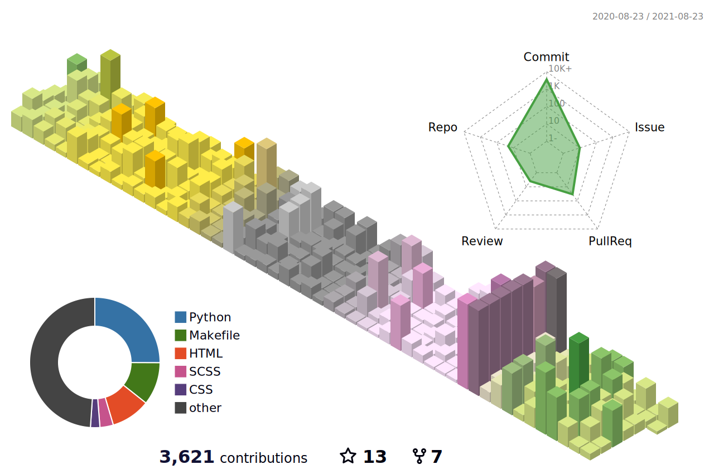

<h1 align="center">Hi 👋, I'am a Backend Developer called Fundor333</h1>


[](https://ko-fi.com/fundor333)
[](https://www.buymeacoffee.com/fundor333)
[](https://saythanks.io/to/github@fundor333.com)

[](https://www.linkedin.com/in/%F0%9F%90%8D-matteo-scarpa-78969263/
)
[](https:fundor333.com/index.xml)
[](https://twitter.com/fundor333)


### Coding Knowledge

key                      |value
-------------------------|-------------------------------------------------------------------
Domain Knowledge         |   
Frameworks               |    
Scientific Tools         |  
DataBases                |    
IDE               |   
Version Control          |    
DevOps                   |   
OS                       |  
Programming Languages    |         



<!--START_SECTION:waka-->


**🐱 My Github Data** 

> 🏆 851 Contributions in the Year 2021
 > 
> 📦 1.6 MB Used in Github's Storage 
 > 
> 💼 Opted to Hire
 > 
> 📜 59 Public Repositories 
 > 
> 🔑 16 Private Repositories  
 > 
**I'm an Early 🐤** 

```text
🌞 Morning    359 commits    ██████░░░░░░░░░░░░░░░░░░░   23.56% 
🌆 Daytime    549 commits    █████████░░░░░░░░░░░░░░░░   36.02% 
🌃 Evening    589 commits    █████████░░░░░░░░░░░░░░░░   38.65% 
🌙 Night      27 commits     ░░░░░░░░░░░░░░░░░░░░░░░░░   1.77%

```
📅 **I'm Most Productive on Monday** 

```text
Monday       282 commits    ████░░░░░░░░░░░░░░░░░░░░░   18.5% 
Tuesday      251 commits    ████░░░░░░░░░░░░░░░░░░░░░   16.47% 
Wednesday    262 commits    ████░░░░░░░░░░░░░░░░░░░░░   17.19% 
Thursday     175 commits    ██░░░░░░░░░░░░░░░░░░░░░░░   11.48% 
Friday       146 commits    ██░░░░░░░░░░░░░░░░░░░░░░░   9.58% 
Saturday     151 commits    ██░░░░░░░░░░░░░░░░░░░░░░░   9.91% 
Sunday       257 commits    ████░░░░░░░░░░░░░░░░░░░░░   16.86%

```


📊 **This Week I Spent My Time On** 

```text
💬 Programming Languages: 
Python                   1 hr 20 mins        ███████░░░░░░░░░░░░░░░░░░   28.23% 
Markdown                 1 hr 7 mins         █████░░░░░░░░░░░░░░░░░░░░   23.44% 
Other                    44 mins             ████░░░░░░░░░░░░░░░░░░░░░   15.58% 
YAML                     29 mins             ██░░░░░░░░░░░░░░░░░░░░░░░   10.25% 
PHP                      27 mins             ██░░░░░░░░░░░░░░░░░░░░░░░   9.44%

🔥 Editors: 
VS Code                  4 hrs 46 mins       █████████████████████████   100.0%

```

**I Mostly Code in Python** 

```text
Python                   23 repos            ████████░░░░░░░░░░░░░░░░░   35.38% 
TeX                      10 repos            ███░░░░░░░░░░░░░░░░░░░░░░   15.38% 
HTML                     7 repos             ██░░░░░░░░░░░░░░░░░░░░░░░   10.77% 
Makefile                 6 repos             ██░░░░░░░░░░░░░░░░░░░░░░░   9.23% 
Java                     5 repos             ██░░░░░░░░░░░░░░░░░░░░░░░   7.69%

```


**Timeline**

 


<!--END_SECTION:waka-->

### Books suggestions
<!-- GOODREADS-LIST:START -->
- [The Phoenix Project: A Novel About IT, DevOps, and Helping Your Business Win](https://www.goodreads.com/review/show/3986076614?utm_medium=api&utm_source=rss) by Gene Kim (⭐️4.24)
- [Introduction to Algorithms](https://www.goodreads.com/review/show/3979104930?utm_medium=api&utm_source=rss) by Thomas H. Cormen (⭐️4.33)
- [The Temple of Django Database Performance](https://www.goodreads.com/review/show/3904584133?utm_medium=api&utm_source=rss) by Andrew Brookins (⭐️3.5)
- [Codice libero (Free as in Freedom): Richard Stallman e la crociata per il software libero](https://www.goodreads.com/review/show/3979088374?utm_medium=api&utm_source=rss) by Sam  Williams (⭐️3.5)
- [Speed Up Your Django Tests](https://www.goodreads.com/review/show/3979084324?utm_medium=api&utm_source=rss) by Adam    Johnson (⭐️4.67)
- [L'uomo che sapeva troppo: Alan Turing e l'invenzione del computer](https://www.goodreads.com/review/show/3379551629?utm_medium=api&utm_source=rss) by David Leavitt (⭐️3.52)
- [Python Testing with pytest: Simple, Rapid, Effective, and Scalable](https://www.goodreads.com/review/show/3379582780?utm_medium=api&utm_source=rss) by Brian Okken (⭐️4.17)
- [Introduction to Graph Theory](https://www.goodreads.com/review/show/3385145021?utm_medium=api&utm_source=rss) by Richard J. Trudeau (⭐️4.07)
- [An Introduction to Statistical Learning: With Applications in R](https://www.goodreads.com/review/show/3385145297?utm_medium=api&utm_source=rss) by Gareth James (⭐️4.61)
- [Python Interviews: Discussions with Python Experts](https://www.goodreads.com/review/show/3385147261?utm_medium=api&utm_source=rss) by Michael Driscoll (⭐️3.41)
<!-- GOODREADS-LIST:END -->

### Blogs posts
<!-- BLOG-POST-LIST:START -->
 🧋 [**Letterhead With ReportLab**](https://fundor333.com/post/2021/letterhead-with-reportlab/): Sometime you need to have a letterhead document generated by your application and here we explain how to make it with Reportlab 
 
 [](https://fundor333.com/post/2021/letterhead-with-reportlab/) 

 🍵 [**Advance Git Config and Ssh Config**](https://fundor333.com/post/2021/advance-git-config-and-ssh-config/): My advance config for git e ssh 
 
 [](https://fundor333.com/post/2021/advance-git-config-and-ssh-config/) 
<!-- BLOG-POST-LIST:END -->

[](https://fundor333.com)
