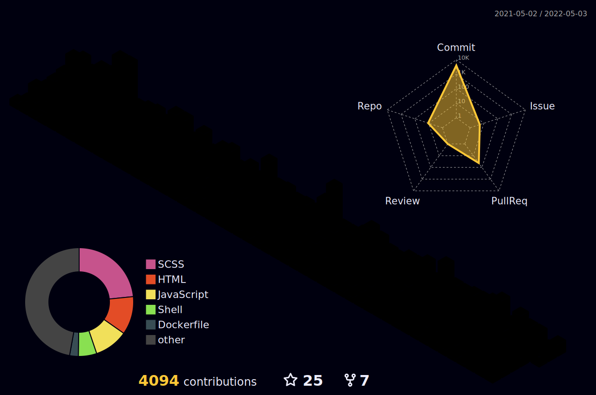

<h1 align="center">Hi 👋, I'am a Backend Developer called Fundor333</h1>

### Coding Knowledge

key                      |value
-------------------------|-------------------------------------------------------------------
Domain Knowledge         |   
Frameworks               |    
Scientific Tools         |  
DataBases                |   
IDE               |   
Version Control          |    
DevOps                   |  
OS                       |  
Programming Languages    |                 
### Stats

<!--START_SECTION:waka-->
<!--END_SECTION:waka-->

### Blog Posts
<!--START_SECTION:feed-->
<!--END_SECTION:feed-->

### Other Stuffs

